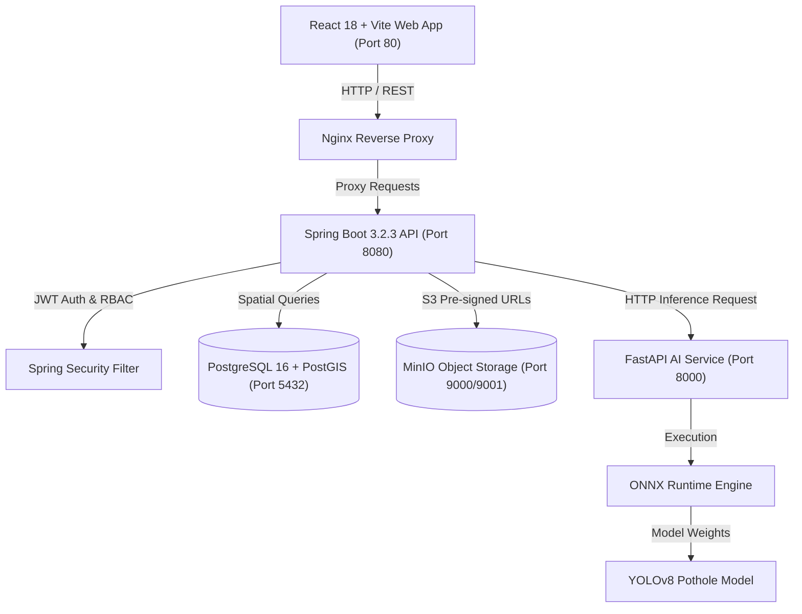

# PotholeX

A civic road inspection and pothole reporting platform that combines citizen-submitted evidence, pothole detection, geospatial routing, duplicate handling, and verified officer workflows.

---

## Overview

Road infrastructure maintenance is frequently hindered by delayed hazard reporting, duplicate report congestion, and fragmented communication between citizens and public works departments. **PotholeX** addresses these challenges by serving as an end-to-end civic reporting and spatial remediation system.

Citizens submit road hazard evidence via image or video along with geographic coordinates. The system processes uploaded media using an ONNX-accelerated YOLO v8 object detection model, classifies pothole severity based on spatial surface area, checks for active spatial duplicates within a 15-meter PostGIS radius, and routes verified reports to the appropriate municipal jurisdiction (e.g., PWD, NHAI, MCD, DDA).

Verified public works officers inspect incoming hazard reports within their assigned geographic domain, transition report statuses through an audited lifecycle (`REPORTED` → `ACKNOWLEDGED` → `IN_PROGRESS` → `RESOLVED`), and record official remediation notes. Citizens receive persistent progress notifications as their reported hazards are acknowledged and repaired.

---

## Assessment / JD Coverage

| JD Requirement | Implementation | Status |
|---|---|---|
| **Pothole Detection from Image** | ONNX Runtime YOLOv8 model runs 640x640 single-pass inference returning bounding box coordinates and confidence scores. | **Implemented** |
| **Video / Dashcam Analysis** | Asynchronous frame sampling engine extracts frames from uploaded dashcam videos (`.mp4`), performs detection, and aggregates results. | **Implemented** |
| **Severity Assessment** | Spatial surface area calculator evaluates relative bounding box area against total image dimensions (`LOW` < 3%, `MEDIUM` 3–8%, `HIGH` > 8%). | **Implemented** |
| **REST API** | Spring Boot 3.2.3 REST API with OpenAPI documentation, JWT authentication, and structured error responses. | **Implemented** |
| **Spatial / GIS Processing** | PostGIS spatial queries (`ST_DWithin`, `ST_MakePoint`, SRID 4326) calculate spatial proximity and assign municipal jurisdictions. | **Implemented** |
| **PostgreSQL / PostGIS** | Relational database schema with Flyway migrations (`V1` to `V8`) and PostGIS spatial indexing. | **Implemented** |
| **Authority Routing** | Geofenced authority jurisdictions map location coordinates to responsible agencies (e.g., Delhi PWD, NHAI). | **Implemented** |
| **Duplicate Detection** | 15-meter spatial radius check prevents duplicate report clutter while allowing fresh reports if a hazard reoccurs after repair. | **Implemented** |
| **Citizen Reporting** | Dedicated citizen portal for evidence submission, live status tracking, map views, and notification alerts. | **Implemented** |
| **Officer Workflow** | Role-gated officer portal with jurisdiction-scoped inboxes, identity verification checks, and state machine status transitions. | **Implemented** |
| **Notifications** | Automated notification engine dispatches updates to citizens when officers update report status. | **Implemented** |
| **Interactive Map** | Leaflet-powered interactive map with custom severity markers, status filtering, bounds querying, and manual coordinate navigation. | **Implemented** |
| **Object Storage** | Dual-bucket MinIO instance stores original evidence media (`pothole-media`) and AI annotated overlays (`pothole-annotated`). | **Implemented** |
| **Dockerized Deployment** | Complete 5-container architecture orchestrating Frontend, Backend, AI Service, PostgreSQL, and MinIO via Docker Compose. | **Implemented** |
| **Automated Testing** | Multi-tier automated test suite covering Vitest frontend unit tests, Pytest AI service tests, and JUnit 5 backend controller/service tests. | **Implemented** |

---

## Key Features

### Citizen Portal (`ROLE_USER`)
- **Evidence Submission**: Submit pothole evidence via single image upload or dashcam video file with interactive location selection or manual coordinate input.
- **AI Feedback**: View immediate AI detection bounding boxes, confidence scores, and severity classifications.
- **Report Lifecycle Tracking**: Track report progress through a visual timeline (`REPORTED` → `ACKNOWLEDGED` → `IN_PROGRESS` → `RESOLVED`).
- **Interactive Map**: View citizen-reported hazards on a color-coded Leaflet map.
- **Notification Inbox**: Receive automated alerts when officers update report status or record remediation notes.

### Verified Officer Portal (`ROLE_OFFICER`)
- **Identity Verification Gate**: Officer accounts undergo verification before gaining access to jurisdiction controls.
- **Jurisdiction-Scoped Inbox**: Officers view only hazard reports within their assigned department and geographic jurisdiction.
- **Official Lifecycle Control**: Officers transition report statuses (`ACKNOWLEDGED`, `IN_PROGRESS`, `RESOLVED`, `REJECTED`) and provide mandatory official notes or rejection reasons.
- **Evidence Inspection**: Inspect high-resolution annotated evidence images and historical status audit logs.

### AI & Computer Vision Engine
- **Model**: ONNX Runtime execution using YOLOv8 weights fine-tuned for pothole surface detection.
- **Inference Configuration**: Standardized 640x640 tensor input, confidence threshold of `0.25`, and Non-Maximum Suppression (NMS) IoU threshold of `0.45`.
- **Severity Rating**: Computes bounding box surface area ratio relative to image frame size to classify hazards into `LOW`, `MEDIUM`, or `HIGH` severity.
- **Detection Bounds**: Handles single-pothole and multi-pothole images with bounding box overlay rendering.

### Spatial GIS Engine
- **PostGIS Integration**: Employs spatial reference SRID 4326 (`WGS 84`) for coordinate persistence and distance calculations.
- **15-Meter Proximity Clustering**: Detects active duplicate reports within a 15-meter radius of existing open reports.
- **Jurisdiction Geofencing**: Automatically routes hazard reports to municipal authorities based on point-in-jurisdiction calculations.

### Object Storage (MinIO)
- **Dual-Bucket Storage Architecture**: Separates original raw user uploads (`pothole-media`) from AI-generated annotated overlay images (`pothole-annotated`).
- **Pre-Signed Security**: Generates temporary pre-signed HTTP access URLs for frontend image rendering.

---

## Architecture



### Container Services Summary

| Container Name | Service | Technology | Port | Purpose |
|---|---|---|---|---|
| `pothole_frontend` | Frontend Web UI | React 18, TypeScript, Vite, Leaflet | `80` | User interface for citizens and officers |
| `pothole_backend` | Core REST API | Java 21, Spring Boot 3.2.3, Flyway | `8080` | Business logic, authentication, GIS routing |
| `pothole_ai_service` | AI Inference API | Python 3.11, FastAPI, ONNX Runtime | `8000` | Pothole detection and severity computation |
| `pothole_postgres` | Relational & GIS Database | PostgreSQL 16, PostGIS 3.4 | `5432` | Spatial indexing and metadata persistence |
| `pothole_minio` | S3 Object Storage | MinIO Dual-Bucket Instance | `9000` / `9001` | Evidence image and video storage |

---

## Tech Stack

- **Frontend**: React `18.2.0`, TypeScript `5.2.2`, Vite `5.1.0`, Leaflet `1.9.4`, React Router `6.22.1`, TailwindCSS `3.4.1`
- **Backend**: Java `21`, Spring Boot `3.2.3`, Spring Security, Spring Data JPA, Hibernate Spatial, Flyway `9.22.3`, JJWT `0.11.5`
- **AI Service**: Python `3.11`, FastAPI `0.109.2`, ONNX Runtime `1.17.1`, OpenCV `4.9.0`, Pillow `10.2.0`, PyTorch `2.2.1`
- **Database & Storage**: PostgreSQL `16.4`, PostGIS `3.4`, MinIO `RELEASE.2024-01-31T01-31-00Z`
- **Deployment & Testing**: Docker, Docker Compose, JUnit 5, Mockito, Pytest, Vitest `1.6.1`

---

## Prerequisites

To run PotholeX, your host machine only requires:
- **Git**
- **Docker Engine** (`v20.10+`)
- **Docker Compose** (`v2.0+` or `docker-compose`)
- **Modern Web Browser** (Chrome, Firefox, Edge, Safari)

*Note: Host installations of Java, Python, Node.js, PostgreSQL, or MinIO are **not** required. All runtime dependencies are containerized.*

---

## Quick Start

### 1. Clone Repository & Setup Environment
```bash
git clone https://github.com/dheeraj17082005/Dheeraj-Smart_Pothole-Detection.git
cd Dheeraj-Smart_Pothole-Detection

# Copy environment variables file
cp .env.example .env
```

### 2. Launch Application
You can use the provided quickstart script or run Docker Compose directly:

**Option A (Automated Quickstart Script)**:
```bash
./scripts/quickstart.sh
```

**Option B (Standard Docker Compose)**:
```bash
docker-compose up --build -d
```

*Note: The AI model weights (`pothole_yolov8.onnx`) are downloaded automatically from Hugging Face during the Docker image build. No manual file copying is required.*

### 3. Open Web Application
Navigate to `http://localhost` in your browser.

---

## Startup Verification

To verify that all 5 services have started and reached healthy status, run:

```bash
docker-compose ps
```

### Expected Output
```text
NAME                 IMAGE                        COMMAND                  SERVICE      CREATED          STATUS                    PORTS
pothole_frontend     potholex-frontend:latest     "nginx -g 'daemon of…"   frontend     1 minute ago     Up 1 minute (healthy)     0.0.0.0:80->80/tcp
pothole_backend      potholex-backend:latest      "java -jar app.jar"      backend      1 minute ago     Up 1 minute (healthy)     0.0.0.0:8080->8080/tcp
pothole_ai_service   potholex-ai-service:latest   "uvicorn app.main:ap…"   ai-service   1 minute ago     Up 1 minute (healthy)     0.0.0.0:8000->8000/tcp
pothole_postgres     postgis/postgis:16-3.4       "docker-entrypoint.s…"   postgres     1 minute ago     Up 1 minute (healthy)     0.0.0.0:5432->5432/tcp
pothole_minio        minio/minio                  "server /data --cons…"   minio        1 minute ago     Up 1 minute (healthy)     0.0.0.0:9000-9001->9000-9001/tcp
```

---

## Recommended Reviewer Walkthrough

Follow this step-by-step sequence to test both Citizen and Officer roles:

### Part A: Citizen Journey (`ROLE_USER`)
1. Open `http://localhost` in your browser. The application opens on the `/login` screen.
2. Click **Register as Citizen** and create an account (e.g. `citizen@test.com` / `Password123!`).
3. Upon registration, you are redirected to the **Citizen Dashboard**.
4. Click **Report Pothole** in the navigation header.
5. Upload the included sample test image:  
   `test-data/evaluation/potholes/istockphoto-502561495-612x612.jpg`
6. Click on the interactive map picker or enter latitude `28.6139` and longitude `77.2090`.
7. Click **Analyze & Submit Report**. Inspect the immediate AI bounding box detections (11 potholes detected, `HIGH` severity).
8. View your newly created report in **My Reports**. Note its initial status: `REPORTED`.
9. Click **View on Map** to see the interactive map marker.
10. Click the **Bell Icon** in the top navigation bar to inspect your initial notification.

### Part B: Officer Journey (`ROLE_OFFICER`)
11. Log out of the Citizen account.
12. Click **Register as Officer** on the login page.
13. Fill in officer details:
    - Full Name: `Officer Sharma`
    - Email: `officer@test.com`
    - Password: `Password123!`
    - Officer ID Code: `OFF-101`
    - Department: `Public Works Department`
    - Jurisdiction Name: `Delhi PWD Central`
    - Jurisdiction Code: `PWD`
    - Latitude: `28.6139` | Longitude: `77.2090`
    - Upload any ID Card image.
14. Submit registration. Note that new officer accounts enter `PENDING_VERIFICATION` status for security.
15. **To verify the officer account for testing**, execute this database command in your terminal:
    ```bash
    docker exec pothole_postgres psql -U pothole_user -d potholedb -c "UPDATE officer_profiles SET verification_status = 'VERIFIED';"
    ```
16. Refresh the officer browser window. You now have full access to the **Officer Jurisdiction Dashboard**.
17. In the **Jurisdiction Inbox**, locate the report submitted by the citizen in Part A.
18. Click **Accept Report**. The status transitions to `ACKNOWLEDGED`.
19. Click **Start Repair Work**. The status transitions to `IN_PROGRESS`.
20. Click **Mark as Resolved** and add remediation notes (e.g. *"Asphalt patch applied"*). The status updates to `RESOLVED`.
21. Log out and log back in as the Citizen (`citizen@test.com`).
22. Check **Notifications**. Verify that status transition alerts (`ACKNOWLEDGED` → `IN_PROGRESS` → `RESOLVED`) have been delivered to the citizen.

---

## Demo Accounts & Test Credentials

If you prefer using pre-created credentials after completing the reviewer walkthrough:

| Role | Email | Password | Details |
|---|---|---|---|
| **Citizen (USER)** | `citizen@test.com` | `Password123!` | Standard citizen test account |
| **Officer (PWD)** | `officer@test.com` | `Password123!` | Verified officer for PWD jurisdiction |

*Note: All credentials above are **TEST/DEMO ONLY**.*

---

## Report Lifecycle State Machine

```text
[ Citizen Submits Evidence ]
            │
            ▼
        REPORTED ──(Officer Rejects with Reason)──► REJECTED
            │
            ▼
       ACKNOWLEDGED (Officer Accepts Report)
            │
            ▼
       IN_PROGRESS  (Repair Work Dispatched)
            │
            ▼
        RESOLVED    (Road Repair Complete)
```

- **Citizen Action Scope**: Submits initial evidence, selects location, views status, and receives notifications. Citizens **cannot** alter report statuses.
- **Officer Action Scope**: Inspects jurisdiction reports, accepts/rejects incoming evidence, transitions status through `ACKNOWLEDGED` → `IN_PROGRESS` → `RESOLVED`, and records official notes.

---

## Image Detection Demo

To test image-based detection:
1. Go to **Report Pothole** in the Citizen Portal.
2. Select the committed test asset:  
   `test-data/evaluation/potholes/istockphoto-502561495-612x612.jpg`
3. The AI service performs single-pass ONNX inference, overlaying green bounding boxes around detected road hazards.
4. Test with a clean road image to verify 0-detection handling:  
   `test-data/evaluation/clean_roads/clean_road_highway.jpg`

---

## Video Detection Demo

PotholeX supports asynchronous video analysis for dashcam footage:
1. Go to **Report Pothole** and switch mode to **Dashcam Video**.
2. Select the sample dashcam video:  
   `test-data/videos/sample_dashcam.mp4`
3. Enter location coordinates and click **Submit Video Stream**.
4. The system returns an immediate **HTTP 202 Accepted** response with a background job polling URL (`/api/v1/detection-jobs/{jobId}`).
5. The background worker samples video frames, runs ONNX inference per frame, aggregates detections, and registers a aggregated report upon completion.

*Note: Video analysis is performed via asynchronous frame sampling, not live real-time video streaming.*

---

## Map & Geospatial Features

- **Interactive Navigation**: Supports pan (left/right/up/down/diagonal), zoom, and custom coordinate jumping.
- **Severity & Status Color Coding**:
  - `HIGH` Severity: Red Marker
  - `MEDIUM` Severity: Orange Marker
  - `LOW` Severity: Yellow Marker
  - `RESOLVED` Status: Green Marker
- **Coordinate Navigation**: Enter custom Latitude and Longitude to inspect specific geographic areas.
- **Viewport Bounds Querying**: Fetches only markers visible within the current map viewport bounds.

---

## Role & Permission Matrix

| Action | Citizen (`ROLE_USER`) | Verified Officer (`ROLE_OFFICER`) |
|---|---|---|
| Register / Login | ✓ | ✓ |
| Submit Pothole Evidence | ✓ | ✖ *(Forbidden - HTTP 403)* |
| View Own Submitted Reports | ✓ | ✓ |
| View Jurisdiction Inbox | ✖ | ✓ |
| Accept / Reject Incoming Report | ✖ | ✓ |
| Transition Report Status | ✖ *(Forbidden - HTTP 403)* | ✓ |
| Receive Status Notifications | ✓ | ✓ |
| View Interactive Map | ✓ | ✓ |

---

## Duplicate Handling & Spatial Proximity Rules

1. **Active Duplicate Clustering**: If a citizen reports a pothole within **15 meters** of an existing open report (`REPORTED`, `ACKNOWLEDGED`, or `IN_PROGRESS`), the system links the report as a duplicate to prevent municipal inbox clutter.
2. **Re-occurring Hazard Protection**: If a pothole reappears at a location where a previous report was marked `RESOLVED`, the system permits a **new active report** to be filed, archiving the old report in history.

---

## Media Validation Rules

- **Supported Formats**: Images (`image/jpeg`, `image/png`, `image/webp`) and Videos (`video/mp4`, `video/quicktime`).
- **File Validation**: Non-empty media payload required (returns `HTTP 400 Bad Request` if media is missing or unreadable).
- **Clean Road Handling**: If an uploaded image contains zero potholes, the system returns `HTTP 200 OK` with 0 detections and notifies the user that no hazard was detected.

---

## REST API Overview

| Domain | Method | Endpoint Path | Role Required | Description |
|---|---|---|---|---|
| **Auth** | `POST` | `/api/v1/auth/register` | Public | Register new Citizen account |
| **Auth** | `POST` | `/api/v1/auth/officer/register` | Public | Register new Officer account |
| **Auth** | `POST` | `/api/v1/auth/login` | Public | Authenticate user & return JWT token |
| **Detection** | `POST` | `/api/v1/potholes/detect-image` | `ROLE_USER` | Submit image for detection & report creation |
| **Detection** | `POST` | `/api/v1/potholes/detect-video` | `ROLE_USER` | Submit video for async frame analysis |
| **Reports** | `GET` | `/api/v1/potholes` | Authenticated | List pothole reports with filters |
| **Reports** | `GET` | `/api/v1/potholes/{id}` | Authenticated | Get detailed report metadata & status history |
| **Status** | `PATCH` | `/api/v1/potholes/{id}/status` | `ROLE_OFFICER` | Update report lifecycle status with notes |
| **Notifs** | `GET` | `/api/v1/notifications` | Authenticated | Fetch user notification list |

---

## Storage Architecture

- **PostgreSQL 16 + PostGIS 3.4**: Persists structured user profiles, officer credentials, report metadata, status audit trails, and PostGIS `GEOMETRY(Point, 4326)` spatial coordinates.
- **MinIO S3 Buckets**:
  - `pothole-media`: Stores raw uploaded evidence images and video files.
  - `pothole-annotated`: Stores AI bounding-box annotated evidence image overlays.

---

## Configuration & Environment Variables

Key environment settings in `.env`:

```env
PORT=80
BACKEND_PORT=8080
AI_SERVICE_PORT=8000
POSTGRES_PORT=5432
MINIO_PORT=9000
MINIO_CONSOLE_PORT=9001
JWT_SECRET=404E635266556A586E3272357538782F413F4428472B4B6250645367566B5970
```

---

## Running Automated Tests

You can run the full multi-tier automated test suite from the repository root:

### 1. Frontend Component Tests (Vitest)
```bash
cd frontend && npm test -- --run
```
*Validated Output*: **28 / 28 Passed** (100%)

### 2. AI Service Unit Tests (Pytest)
```bash
docker exec pothole_ai_service pytest /app/tests
```
*Validated Output*: **22 / 22 Passed** (100%)

### 3. Backend Unit & Controller Tests (Maven JUnit 5)
```bash
cd backend && mvn test
```
*Validated Output*: **107 / 107 Passed** (100%)

### Combined Test Execution Summary
- **Total Automated Tests**: **157 / 157 PASSED** (0 Failures, 0 Skipped)

---

## Troubleshooting

### Issue: Containers fail to start due to port conflicts
- **Solution**: Check if ports `80`, `8080`, `8000`, `5432`, or `9000` are used by another process:
  ```bash
  lsof -i :8080 -i :8000 -i :80
  ```
- Stop conflicting services and run `docker-compose up -d`.

### Issue: Existing container conflict error during build
- **Solution**: Remove existing container instances and restart:
  ```bash
  docker rm -f pothole_postgres pothole_minio pothole_backend pothole_ai_service pothole_frontend
  docker-compose up --build -d
  ```

### Issue: Inspect container logs
- **Backend Logs**: `docker-compose logs -f backend`
- **AI Service Logs**: `docker-compose logs -f ai-service`
- **Frontend Logs**: `docker-compose logs -f frontend`

---

## Resetting the Demo Environment

To completely reset the application, clear databases, and wipe stored media:

```bash
# WARNING: Destructive command - clears local container database & media volumes
docker-compose down -v
docker-compose up --build -d
```

---

## Security & Trust Model

- **Server-Side Enforcement**: All authorization rules (role separation, status updates, jurisdiction boundaries) are enforced by backend Spring Security filters, not merely hidden in the UI.
- **Input Validation**: Uploaded media streams are validated against standard MIME signatures and byte lengths.
- **Evidence Traceability**: User coordinates and EXIF timestamps serve as submission evidence; official repair validation remains under officer domain control.

---

## Known Limitations

- **Detection Boundaries**: Small, heavily shadowed, or visually obscured distant potholes may fall below confidence thresholds (`< 0.25`).
- **Domain Adaptation**: YOLO model performance varies across non-standard road materials (e.g. unpaved dirt roads).
- **Asynchronous Video**: Dashcam video analysis processes sampled frames asynchronously rather than rendering real-time streaming bounding boxes.
- **Simulated Authority Dispatch**: External municipal ticketing dispatches are logged and simulated within the database schema rather than triggering live external government API integrations.

---

## Repository Structure

```text
Dheeraj-Smart_Pothole-Detection/
├── README.md
├── docker-compose.yml
├── .env.example
├── scripts/
│   └── quickstart.sh
├── backend/
│   ├── Dockerfile
│   ├── pom.xml
│   └── src/
│       ├── main/java/com/pothole/
│       └── main/resources/db/migration/
├── frontend/
│   ├── Dockerfile
│   ├── package.json
│   ├── vite.config.ts
│   └── src/
├── ai-service/
│   ├── Dockerfile
│   ├── download_model.py
│   ├── requirements.txt
│   ├── app/
│   └── tests/
├── docs/
│   ├── ARCHITECTURE.md
│   ├── ROLE_PERMISSION_MATRIX.md
│   ├── API_AUTHORIZATION_MATRIX.md
│   ├── COMPLETE_FUNCTIONALITY_CATALOG.md
│   ├── MASTER_SYSTEM_CHECKLIST.md
│   ├── GITHUB_CLONE_VERIFICATION.md
│   └── PRE_COMMIT_REPRODUCIBILITY_REPORT.md
└── test-data/
    ├── evaluation/potholes/
    ├── evaluation/clean_roads/
    └── videos/
```

---

## Further Documentation

For detailed technical references, inspect the documentation in `/docs`:
- [System Architecture Specification](file:///Users/dheerajkumar/Dheeraj-Smart_Pothole-Detection/docs/ARCHITECTURE.md)
- [Role Permission Matrix](file:///Users/dheerajkumar/Dheeraj-Smart_Pothole-Detection/docs/ROLE_PERMISSION_MATRIX.md)
- [API Authorization Security Matrix](file:///Users/dheerajkumar/Dheeraj-Smart_Pothole-Detection/docs/API_AUTHORIZATION_MATRIX.md)
- [Complete Functionality Catalog](file:///Users/dheerajkumar/Dheeraj-Smart_Pothole-Detection/docs/COMPLETE_FUNCTIONALITY_CATALOG.md)
- [Master System Checklist](file:///Users/dheerajkumar/Dheeraj-Smart_Pothole-Detection/docs/MASTER_SYSTEM_CHECKLIST.md)
- [GitHub Clone Verification Report](file:///Users/dheerajkumar/Dheeraj-Smart_Pothole-Detection/docs/GITHUB_CLONE_VERIFICATION.md)

---

## Suggested Demo Scenarios

1. **Scenario 1 (Valid Citizen Report)**: Upload `istockphoto-502561495-612x612.jpg` as Citizen → Observe 11 potholes detected → Submit report.
2. **Scenario 2 (Clean Road Check)**: Upload `clean_road_highway.jpg` as Citizen → Observe 0 detections returned cleanly.
3. **Scenario 3 (Duplicate Prevention)**: Submit a second report within 15 meters of an open report → System flags duplicate report.
4. **Scenario 4 (Officer Lifecycle)**: Officer logs in → Views jurisdiction inbox → Accepts report (`ACKNOWLEDGED`) → Starts work (`IN_PROGRESS`) → Resolves report (`RESOLVED`).
5. **Scenario 5 (Officer Rejection)**: Officer rejects invalid evidence report with mandatory reason text.
6. **Scenario 6 (Authorization Protection)**: Citizen attempts direct `PATCH` status update → Backend returns `HTTP 403 Forbidden`.
7. **Scenario 7 (Citizen Notifications)**: Citizen checks notification bell → Observes state transition alerts.
8. **Scenario 8 (Interactive Map)**: Open Map view → Filter by status/severity → Inspect bounding box query markers.
