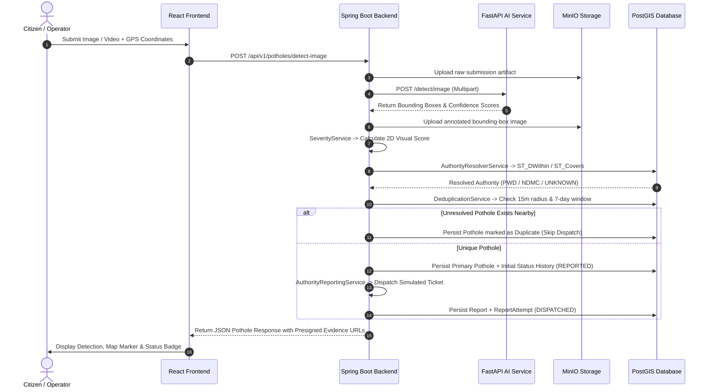

# Smart Pothole Detection and Reporting System

An end-to-end civic technology platform for automated road hazard intelligence. The system ingests citizen dashcam images and video streams, runs containerized AI inference using FastAPI and YOLOv8 ONNX, calculates visual severity heuristics, performs spatial PostGIS authority resolution, handles video frame aggregation and inter-submission deduplication, dispatches automated simulated civic work orders, and visualizes remediation status across an interactive operational dashboard.

---

## ⚡ Quick Start (Evaluator Setup)

Launch the complete 5-container stack with a single command:

```bash
docker-compose up -d --build
```

Once all containers report healthy, open the operational dashboard in your browser:

👉 **[http://localhost](http://localhost)**

---

## Table of Contents
- [Problem Statement](#problem-statement)
- [Key Features](#key-features)
- [System Architecture](#system-architecture)
- [Technology Stack](#technology-stack)
- [AI Model & Computer Vision](#ai-model--computer-vision)
- [System Processing Flow](#system-processing-flow)
- [Repository Structure](#repository-structure)
- [Prerequisites](#prerequisites)
- [Docker Setup & Quickstart](#docker-setup--quickstart)
- [Environment Variables](#environment-variables)
- [API Endpoints](#api-endpoints)
- [API Usage Examples](#api-usage-examples)
- [Database & Spatial Architecture](#database--spatial-architecture)
- [Object Storage (MinIO)](#object-storage-minio)
- [Civic Authority Resolution](#civic-authority-resolution)
- [Visual Severity Calculation](#visual-severity-calculation)
- [Deduplication Strategy (Type A & Type B)](#deduplication-strategy-type-a--type-b)
- [Civic Authority Reporting](#civic-authority-reporting)
- [Automated Testing](#automated-testing)
- [Demonstration Flow](#demonstration-flow)
- [Known Limitations](#known-limitations)
- [Future Improvements](#future-improvements)
- [Third-Party Attribution](#third-party-attribution)

---

## Problem Statement

Potholes and road surface degradation cause severe vehicular damage, traffic congestion, and fatal road accidents worldwide. Municipal road maintenance teams often struggle with slow, manual, citizen-complaint workflows, redundant duplicate reports, jurisdictional ambiguity between municipal and highway authorities, and lack of prioritized severity tracking.

The **Smart Pothole Detection and Reporting System** solves this by providing:
1. **Automated Vision Pipeline**: Rapid detection and bounding box annotation on dashcam photos and video streams.
2. **Deterministic Spatial Resolution**: Automatic routing of reports to the exact municipal or highway authority via PostGIS spatial intersection.
3. **Automated Deduplication**: Multi-tier deduplication preventing duplicate dispatch tickets for identical physical potholes.
4. **Transparent Remediation Tracking**: Real-time status lifecycle management with an immutable audit trail.

---

## Key Features

- 📸 **Synchronous Image Detection**: Instant AI detection, bounding box extraction, and annotated evidence generation.
- 🎥 **Asynchronous Video Stream Processing**: Non-blocking background job queueing (HTTP 202 Accepted) with client polling and frame sampling at 2 FPS.
- 🎯 **Intra-Video Aggregation (Type A)**: Spatial-temporal tracking that groups consecutive video frames into a single physical pothole record with optimal representative frame selection.
- 🔍 **Inter-Report Deduplication (Type B)**: PostGIS spatial-temporal matching (15-meter radius, 7-day window) flagging redundant citizen reports to avoid dispatch spam.
- 🗺️ **PostGIS Authority Resolution**: Hierarchical spatial assignment (Road Network Buffer $\to$ Municipal Polygon $\to$ `UNKNOWN_AUTHORITY` fallback).
- 📊 **Visual 2D Severity Heuristic**: Normalized scoring based on bounding-box road area percentage and confidence weighting (`LOW`, `MEDIUM`, `HIGH`).
- 📨 **Simulated Work Order Dispatch**: Automated authority reporting with exponential backoff retries and idempotent dispatch keys.
- 🗺️ **Interactive Operational Dashboard**: React 18 + Leaflet mapping with real-time viewport querying, severity-colored markers, status updates, and audit timeline history.

---

## System Architecture

```
                                    +-------------------------------------------------------+
                                    |                   React Web Frontend                  |
                                    |              (Vite / TypeScript / Leaflet)            |
                                    |                Port: 80 / Dev Port: 5173              |
                                    +---------------------------+---------------------------+
                                                                |
                                                                | REST / HTTP Multipart
                                                                v
+-------------------------------------------------------------------------------------------------------------------------------+
|                                             Spring Boot 3.2.3 Backend API (Java 21)                                           |
|                                                           Port: 8080                                                          |
|                                                                                                                               |
|   +--------------------------+   +--------------------------+   +--------------------------+   +--------------------------+   |
|   |   ImageDetectionService  |   |   VideoDetectionService  |   |      SeverityService     |   | AuthorityResolverService |   |
|   +--------------------------+   +--------------------------+   +--------------------------+   +--------------------------+   |
|   +--------------------------+   +--------------------------+   +--------------------------+   +--------------------------+   |
|   |   DeduplicationService   |   | AuthorityReportingService|   |    PotholeQueryService   |   |  GlobalExceptionHandler  |   |
|   +--------------------------+   +--------------------------+   +--------------------------+   +--------------------------+   |
+-------------------+---------------------------+-----------------------------------+-------------------------------------------+
                    |                           |                                   |
                    v                           v                                   v
+-----------------------------+ +-------------------------------+ +---------------------------------+
|     FastAPI AI Service      | |      PostgreSQL 16 + PostGIS  | |          MinIO Storage          |
|    (Python 3.11 / ONNX)     | |          Port: 5432           | |       Ports: 9000 / 9001        |
|         Port: 8000          | |                               | |                                 |
|  - YOLOv8s-RDD ONNX Runtime | |  - PostGIS Spatial Queries    | |  - pothole-raw/                 |
|  - Frame Extraction (OpenCV)| |  - Flyway Migrations (V1-V5)  | |  - pothole-annotated/           |
|  - Bounding Box Annotator   | |  - Seed Demo Authorities      | |  - Presigned URL Generation     |
|  - Healthcheck (/health)    | |  - Audit Status History       | |                                 |
+-----------------------------+ +-------------------------------+ +---------------------------------+
```

---

## Technology Stack

| Layer | Technology | Version | Description |
|---|---|---|---|
| **Frontend** | React, TypeScript, Vite, TailwindCSS | `18.2.0` / `5.3.3` / `5.1.0` | Responsive operational dashboard, Leaflet mapping |
| **Backend** | Spring Boot, Java, Spring Data JPA, Flyway | `3.2.3` / `21` / `10.7.0` | Transactional core, spatial business logic, REST API |
| **AI Inference** | FastAPI, ONNX Runtime, OpenCV, NumPy | `0.110.0` / `1.17.1` / `4.9.0` | CPU-optimized YOLOv8 inference & video sampling |
| **Database** | PostgreSQL + PostGIS Extension | `16.2` / `3.4.1` | Spatial indexing (`GIST`), geography distance queries |
| **Object Storage** | MinIO Object Store (S3-compatible) | `minio/minio:latest` | Image/video binary storage & presigned URLs |
| **Containerization**| Docker & Docker Compose | Compose v2 / Spec 3.8 | Multi-service local deployment with healthchecks |

---

## AI Model & Computer Vision

The system integrates an ONNX runtime CPU pipeline powered by the fine-tuned Road Damage Detection model:

- **Model Name**: `peterhdd/pothole-detection-yolov8`
- **Inference Runtime**: ONNX Runtime (CPU Execution Provider)
- **Input Dimensions**: `[1, 3, 640, 640]` RGB float32
- **Default Confidence Threshold**: `0.25` (production default; operates reliably across `0.20`–`0.25`)
- **Input Tensor**: `images` shape `[1, 3, 640, 640]` RGB normalized `[0.0, 1.0]` (Letterbox aspect-ratio preserving)
- **Output Tensor**: `output0` shape `[1, 5, 8400]`
- **Target Class**: Class ID `0` (`pothole`)
- **Operational Confidence Threshold**: `0.20`–`0.25` (Default: `0.25`)
- **Supported Formats**: JPEG, PNG, WebP (Images); MP4, WebM, MOV (Videos)
- **Operating Domain**: Road-facing / vehicle dashcam / mobile perspective road imagery.
- **Empirical Model Comparison**: Full multi-model evaluation documented in [MODEL_COMPARISON.md](docs/MODEL_COMPARISON.md).

> [!NOTE]
> **Domain Alignment & Model Limitations**:
> - **In-Domain Strengths**: The model delivers strong, accurate detections on forward-facing road imagery with visible road context and asphalt distress.
> - **Domain Sensitivity**: Close-up macro photos, extreme top-down angles, and gravel/unpaved textures fall outside the training distribution and may yield lower confidence or zero proposals.
> - **2D Heuristic**: Severity calculations reflect 2D pixel area and confidence, not physical 3D cavity depth.

---

## System Processing Flow



---

## Repository Structure

```
.
├── ai-service/                 # FastAPI Python AI Inference Service
│   ├── app/
│   │   ├── config.py           # Application settings & validation
│   │   ├── image_processor.py  # Image preprocessing & annotation
│   │   ├── main.py             # FastAPI routes & lifespan
│   │   ├── model.py            # ONNX Runtime model session wrapper
│   │   ├── schemas.py          # Pydantic request/response schemas
│   │   └── video_processor.py  # Video frame extraction & sampling
│   ├── download_model.py       # Standalone ONNX model downloader
│   ├── Dockerfile              # Container definition for AI service
│   ├── requirements.txt        # Python dependencies
│   └── tests/                  # Pytest unit & integration test suite
├── backend/                    # Spring Boot REST API System of Record
│   ├── src/main/java/com/pothole/
│   │   ├── client/             # AI service HTTP REST client
│   │   ├── config/             # Spring, Web, MinIO & Executor config
│   │   ├── controller/         # REST API endpoints (/api/v1)
│   │   ├── dto/                # Request / Response transfer objects
│   │   ├── exception/          # Global exception handling & ProblemDetail
│   │   ├── model/              # JPA Domain Entities (Pothole, Report, etc.)
│   │   ├── repository/         # Spring Data JPA & PostGIS Repositories
│   │   └── service/            # Core business, severity, auth & dedup services
│   ├── src/main/resources/
│   │   ├── application.yml     # Application configuration
│   │   └── db/migration/       # Flyway SQL migrations (V1 through V5)
│   ├── Dockerfile              # Multi-stage container build for Backend
│   └── pom.xml                 # Maven build & dependencies
├── frontend/                   # React 18 + Vite + Leaflet Web Application
│   ├── src/
│   │   ├── components/         # Leaflet Map, Tables, Navbar, Modals
│   │   ├── hooks/              # Geolocation & Detection Job polling hooks
│   │   ├── pages/              # Dashboard, Pothole Detail, List, Upload pages
│   │   ├── services/           # Axios REST API Client
│   │   └── types/              # TypeScript interface definitions
│   ├── Dockerfile              # Nginx multi-stage build for Frontend
│   ├── nginx.conf              # Nginx SPA routing configuration
│   └── package.json            # Node.js dependencies & scripts
├── database/                   # Standalone database migration & seed references
├── docs/                       # Architectural specs, model details & demo scripts
│   ├── ARCHITECTURE.md         # Master architecture blueprint
│   ├── DEMO.md                 # 14-step demonstration walkthrough
│   ├── MODEL_ATTRIBUTION.md    # Model specifications and metrics
│   └── SEVERITY.md             # Visual severity algorithm documentation
├── test-data/                  # Demonstration media files
│   ├── images/                 # Sample road images (potholes & clean asphalt)
│   └── videos/                 # Sample dashcam MP4 video streams
├── docker-compose.yml          # Multi-container orchestration specification
├── .env.example                # Documented configuration template
└── README.md                   # System documentation
```

---

## Prerequisites

- **Docker**: Version `24.0.0+`
- **Docker Compose**: Version `v2.20.0+`
- **Memory**: Minimum 4 GB RAM recommended for multi-container stack
- **Local Ports Available**: `80` (or `5173`), `8080`, `8000`, `9000`, `9001`, `5432`

---

## Docker Setup & Quickstart

### 1. Clone Repository & Setup Environment
```bash
cp .env.example .env
```

### 2. Build and Launch Stack
```bash
docker compose build --no-cache
docker compose up -d
```

### 3. Verify Container Health
```bash
docker compose ps
```
All 5 containers should indicate `healthy` (or `running`):
- `pothole_postgres` (PostGIS)
- `pothole_minio` (Object Storage)
- `pothole_ai_service` (FastAPI)
- `pothole_backend` (Spring Boot)
- `pothole_frontend` (Nginx React SPA)

### 4. Access URLs
- **Web Dashboard**: [http://localhost](http://localhost) (or [http://localhost:5173](http://localhost:5173))
- **Backend REST API**: [http://localhost:8080/api/v1](http://localhost:8080/api/v1)
- **AI Service Health**: [http://localhost:8000/health](http://localhost:8000/health)
- **MinIO Web Console**: [http://localhost:9001](http://localhost:9001) (User: `minioadmin`, Pass: `minioadminpassword`)

---

## Environment Variables

| Variable | Default Value | Description |
|---|---|---|
| `POSTGRES_DB` | `potholedb` | PostgreSQL database name |
| `POSTGRES_USER` | `pothole_user` | Database user name (assessment default) |
| `POSTGRES_PASSWORD` | `pothole_password` | Database password (assessment default) |
| `POSTGRES_PORT` | `5432` | Host port mapped to PostGIS |
| `MINIO_ROOT_USER` | `minioadmin` | MinIO root access key |
| `MINIO_ROOT_PASSWORD`| `minioadminpassword` | MinIO root secret key |
| `MINIO_PORT` | `9000` | S3 API endpoint port |
| `MINIO_CONSOLE_PORT` | `9001` | MinIO web console port |
| `AI_SERVICE_PORT` | `8000` | FastAPI inference service port |
| `AI_SERVICE_URL` | `http://ai-service:8000` | Internal backend-to-AI communication URL |
| `AI_CONFIDENCE_THRESHOLD` | `0.25` | Minimum bounding box confidence filter |
| `VIDEO_SAMPLE_FPS` | `2.0` | Frame sampling rate for video stream analysis |
| `BACKEND_PORT` | `8080` | Spring Boot REST API port |
| `FRONTEND_PORT` | `80` | Nginx HTTP port for React application |
| `VITE_API_BASE_URL` | `http://localhost:8080/api/v1` | Frontend API target endpoint |

---

## API Endpoints

| Method | Path | Description |
|---|---|---|
| `POST` | `/api/v1/potholes/detect-image` | Synchronously analyze image, persist pothole, and dispatch report |
| `POST` | `/api/v1/potholes/detect-video` | Asynchronously submit video stream; returns HTTP 202 + `jobId` |
| `GET` | `/api/v1/detection-jobs/{jobId}` | Poll video detection job progress and aggregate results |
| `GET` | `/api/v1/potholes` | Paginated pothole list with filtering (`status`, `severity`, `authorityId`) |
| `GET` | `/api/v1/potholes/map` | Viewport bounding-box spatial query for Leaflet markers |
| `GET` | `/api/v1/potholes/{id}` | Detailed pothole record with presigned image URLs and authority details |
| `GET` | `/api/v1/potholes/{id}/history` | Audit timeline of lifecycle status transitions |
| `PATCH`| `/api/v1/potholes/{id}/status` | Transition status (`REPORTED` $\to$ `ACKNOWLEDGED` $\to$ `IN_PROGRESS` $\to$ `RESOLVED`) |
| `GET` | `/api/v1/authorities` | List all seeded civic authorities |
| `GET` | `/api/v1/dashboard/stats` | Aggregated metrics for operational dashboard cards |
| `GET` | `/actuator/health` | Spring Boot system health status |

---

## API Usage Examples

### 1. Detect Pothole from Image
```bash
curl -s -X POST "http://localhost:8080/api/v1/potholes/detect-image" \
  -F "file=@test-data/images/pothole_sample.jpg;type=image/jpeg" \
  -F "latitude=28.6200" \
  -F "longitude=77.2200" \
  -F "addressText=Connaught Place, New Delhi"
```

### 2. Submit Video for Asynchronous Processing
```bash
curl -s -X POST "http://localhost:8080/api/v1/potholes/detect-video" \
  -F "file=@test-data/videos/sample_dashcam.mp4;type=video/mp4" \
  -F "latitude=28.6200" \
  -F "longitude=77.2200" \
  -F "addressText=Ring Road near CP"
```
*Returns:* `{"jobId":"...","status":"PENDING","pollUrl":"/api/v1/detection-jobs/..."}`

### 3. Poll Video Job Status
```bash
curl -s "http://localhost:8080/api/v1/detection-jobs/<JOB_ID>"
```

### 4. Fetch Paginated Potholes
```bash
curl -s "http://localhost:8080/api/v1/potholes?page=0&size=10&status=REPORTED"
```

### 5. Transition Pothole Status
```bash
curl -s -X PATCH "http://localhost:8080/api/v1/potholes/<POTHOLE_ID>/status" \
  -H "Content-Type: application/json" \
  -d '{
    "newStatus": "ACKNOWLEDGED",
    "changedBy": "Officer Kumar",
    "notes": "Work crew assigned for repair."
  }'
```

---

## Database & Spatial Architecture

The application uses **PostgreSQL 16** with **PostGIS 3.4**. All spatial entities are stored in **WGS 84 (`SRID 4326`)** and use spatial indexing (`GIST`):

- `potholes.location`: `GEOMETRY(Point, 4326)` — Indexed via `idx_potholes_location`.
- `authority_jurisdictions.geometry`: `GEOMETRY(Geometry, 4326)` — Polygon/MultiPolygon and LineString geometries indexed via `idx_authority_jurisdictions_geom`.
- **Flyway Database Migrations**: 5 migrations (`V1__...` through `V5__...`) define schema, spatial constraints, foreign keys, triggers, and seed demo authority jurisdictions.

---

## Object Storage (MinIO)

MinIO provides S3-compatible storage for all binary media. The backend interacts through the official MinIO Java SDK:
- `pothole-raw/`: Original uploaded JPEG/PNG citizen submissions and raw MP4 dashcam feeds.
- `pothole-annotated/`: Processed images overlaid with YOLOv8 bounding boxes and confidence tags.
- **Secure Access**: All media URLs delivered to the frontend are time-limited presigned S3 URLs.

---

## Civic Authority Resolution

When a pothole is recorded, `AuthorityResolverService` determines the responsible agency using hierarchical spatial priority:

```
                          [ Pothole GPS Coordinate ]
                                       |
                                       v
                +----------------------------------------------+
                | Step 1: Road Network Check (Highways / PWD)   |
                | ST_DWithin(geom::geography, point::geography)|
                +----------------------+-----------------------+
                                       |
                     +-----------------+-----------------+
                     | Matched                           | No Match
                     v                                   v
             [ Road Authority ]          +-------------------------------+
           (e.g., PWD / NHAI)            | Step 2: Municipal Polygon     |
                                         | ST_Covers(geom, point)        |
                                         +---------------+---------------+
                                                         |
                                       +-----------------+-----------------+
                                       | Matched                           | No Match
                                       v                                   v
                               [ Municipal Council ]              [ UNKNOWN_AUTHORITY ]
                             (e.g., NDMC / MCD North)              (Fallback Queue)
```

---

## Visual Severity Calculation

> [!IMPORTANT]
> **Severity is a 2D visual camera-frame heuristic**. It is calculated based on relative bounding box pixel area and detection confidence within the camera field of view. It **does NOT** represent actual 3D physical depth, millimeter depth measurements, or vehicle chassis impact risk.

### Mathematical Formulation

1. **Visual Area Ratio ($R$)**:
   $$R = \frac{\text{Bounding Box Area}}{\text{Image Area}} = \frac{(x_{\max} - x_{\min}) \times (y_{\max} - y_{\min})}{W \times H}$$

2. **Single Detection Score ($S$)**:
   $$S = \min\left(100.0, \; R \times 1000.0 \times C\right)$$

3. **Aggregate Severity Score ($S_{\text{agg}}$)**:
   $$S_{\text{agg}} = \min\left(100.0, \; \sum_{i=1}^{k} S_i\right)$$

### Classification Rules

- **`LOW`**: $S_{\text{agg}} < 20.0$ (minor surface fissures occupying $< 2\%$ frame area)
- **`MEDIUM`**: $20.0 \le S_{\text{agg}} < 50.0$ (moderate road defects occupying $2\% - 5\%$ frame area)
- **`HIGH`**: $S_{\text{agg}} \ge 50.0$ or pothole count $\ge 3$ in cluster (severe craters or extensive structural pavement deterioration)

---

## Deduplication Strategy (Type A & Type B)

The architecture strictly distinguishes between two independent deduplication concepts:

### Type A: Intra-Video Frame Aggregation
- When processing video streams, multiple consecutive frames may detect the same physical pothole.
- `VideoDetectionService` tracks bounding box spatial overlap and motion trajectory across sampled frames (2 FPS), aggregating frame-level detections into a single unique `Pothole` entity.
- Selects the single highest visual footprint / confidence frame as the representative evidence image.

### Type B: Inter-Report Duplicate Detection
- Different citizens or vehicles may submit photos of the same pothole over time.
- `DeduplicationService` performs a PostGIS query checking if any active (unresolved) pothole exists within **15 meters** and **7 days**.
- If found, the new submission is saved with `is_duplicate = true` linked to `duplicate_of_id`. Duplicate entries do not trigger redundant authority tickets.

---

## Civic Authority Reporting

> [!NOTE]
> For evaluation and assessment purposes, external civic authority dispatch is **simulated**.

- `AuthorityReportingService` generates unique idempotent dispatch keys (`report-{potholeId}-{authorityId}`).
- Executes with exponential backoff retry logic (up to 3 attempts).
- Issues mock municipal work order tracking numbers (e.g., `MUNICIPAL-DEMO-2026-000001`).
- Duplicate reports (Type B) and `UNKNOWN_AUTHORITY` records bypass automated dispatch.

---

## Automated Testing

The codebase includes **139 automated tests across 4 test suites**:

### 1. Spring Boot Backend Tests (93 Tests)
```bash
cd backend
mvn test
```

### 2. AI Service Pytest Suite (17 Tests)
```bash
cd ai-service
.venv/bin/python -m pytest tests/ -v
```

### 3. Frontend Vitest Suite (28 Tests)
```bash
cd frontend
npm test -- --run
```

### 4. PostGIS Testcontainers Integration Test (1 Test)
```bash
cd backend
TESTCONTAINERS_RYUK_DISABLED=true mvn test -Dtest=PostgisRepositoryIT
```

---

## Demonstration Flow

Follow [docs/DEMO.md](docs/DEMO.md) for the exact 14-step walkthrough:
1. `docker compose up -d`
2. Open dashboard at [http://localhost](http://localhost)
3. Upload `test-data/images/pothole_sample.jpg` with coordinates `(28.6200, 77.2200)`
4. View real-time YOLOv8 bounding-box annotation
5. Verify `HIGH`/`MEDIUM`/`LOW` severity score
6. Verify PostGIS assignment to `DEMO New Delhi Municipal Council (NDMC)`
7. Verify simulated work order ticket generation
8. View pothole on Leaflet map and detail page
9. Transition status (`REPORTED` $\to$ `ACKNOWLEDGED` $\to$ `IN_PROGRESS` $\to$ `RESOLVED`)
10. Upload `test-data/videos/sample_dashcam.mp4` and observe async polling and frame aggregation

---

## Known Limitations

1. **Authentication & Authorization**: Omitted by architectural design for rapid local civic tech demonstration.
2. **Visual 2D Depth Limitation**: Single-camera 2D vision cannot determine water-filled pothole millimeter depth without stereo cameras or LiDAR.
3. **Simulated Civic Dispatch**: Government work orders are simulated with mock dispatch clients rather than live proprietary civic CRM integrations.
4. **Demo Authority GIS Geometries**: Seeded polygons represent simulated boundaries for New Delhi / NCR demonstration purposes.
5. **Synchronous Video Sampling**: Video sampling runs in a bounded thread pool; high-throughput multi-stream production environments would benefit from a dedicated distributed worker queue.

---

## Future Improvements

- Edge deployment on Raspberry Pi / NVIDIA Jetson dashcam hardware.
- Real-time citizen push notifications upon pothole repair completion.
- LiDAR / stereo camera integration for true volumetric 3D pothole measurement.
- Municipal GIS export connectors (Shapefile, GeoJSON, ArcGIS Server).

---

## Third-Party Attribution

- **AI Model**: [`peterhdd/pothole-detection-yolov8`](https://huggingface.co/peterhdd/pothole-detection-yolov8) (Apache-2.0 License).
- **Map Data**: © [OpenStreetMap](https://www.openstreetmap.org/copyright) contributors.
- **Map Rendering**: [Leaflet.js](https://leafletjs.com) (BSD 2-Clause License).
