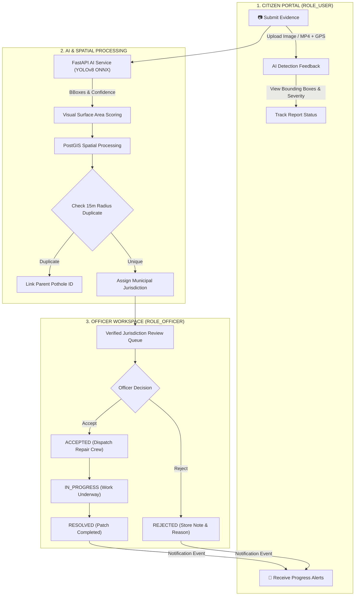

# PotholeX — AI-Powered Civic Road Inspection & Defect Remediation

> An end-to-end civic telematics platform that turns citizen-submitted road evidence into verified, AI-analyzed defect reports, routes them by PostGIS spatial jurisdiction, and empowers public works officers to manage official repairs.

---

## 🔄 End-to-End System Workflow



---

## ⚡ Quick Start (3 Steps)

### 1. Clone & Set Environment
```bash
git clone https://github.com/dheeraj17082005/Dheeraj-Smart_Pothole-Detection.git
cd Dheeraj-Smart_Pothole-Detection
cp .env.example .env
```

### 2. Launch Application (Docker)
```bash
docker-compose up -d --build
```
*(AI model weights `pothole_yolov8.onnx` are downloaded automatically on build.)*

### 3. Open in Browser
Open **`http://localhost`** in Chrome or any modern web browser.

---

## 🏗️ Architecture & Technology Stack

```mermaid
graph TD
    Client["React 18 + TypeScript (Port 80)"] -->|REST API| Backend["Spring Boot 3.2 API (Port 8080)"]
    Backend -->|JWT & Security| Auth["Spring Security"]
    Backend -->|Spatial Queries| DB[("PostgreSQL 16 + PostGIS (Port 5432)")]
    Backend -->|Presigned Media URLs| MinIO[("MinIO S3 Buckets (Port 9000/9001)")]
    Backend -->|Inference Call| AIService["FastAPI Service (Port 8000)"]
    AIService -->|Model Weights| ONNX["YOLOv8 ONNX Model"]
```



| Service | Technology | Port | Purpose |
|---|---|---|---|
| **Frontend** | React 18, TypeScript, Vite, Leaflet | `80` | Responsive web UI for Citizens and Officers |
| **Backend** | Java 21, Spring Boot 3.2, Flyway | `8080` | Core REST API, JWT auth, PostGIS spatial routing |
| **AI Microservice** | Python 3.11, FastAPI, ONNX Runtime | `8000` | YOLOv8 object detection & visual severity scoring |
| **Database** | PostgreSQL 16, PostGIS 3.4 | `5432` | Spatial GIST indexing & relational persistence |
| **Storage** | MinIO Dual-Bucket Instance | `9000` / `9001` | Raw uploads (`pothole-raw`) & annotated media (`pothole-annotated`) |

---

## 👥 Key Features & Role Separation

### 👤 Citizen Portal (`ROLE_USER`)
- **Report Pothole**: Upload image or dashcam video (`.mp4`) with GPS coordinates.
- **AI Detection Feedback**: View YOLOv8 bounding box overlays, confidence score, and calculated severity class (`LOW`, `MEDIUM`, `HIGH`).
- **Live Map**: View verified road defect markers on an interactive Leaflet GIS map.
- **Real-Time Notifications**: Receive persistent in-app notifications when officers update report status.

### 👮 Verified Officer Portal (`ROLE_OFFICER`)
- **Jurisdiction Inbox**: View reports strictly within assigned geographic division and radius.
- **Verification Gate**: Unverified officer profiles remain locked until administrative identity verification.
- **Official Lifecycle Control**: Manage canonical report status transitions:
  - `SUBMITTED` ➔ `ACCEPTED` (Accept report)
  - `ACCEPTED` ➔ `IN_PROGRESS` (Start repair work)
  - `IN_PROGRESS` ➔ `RESOLVED` (Mark remediation complete)
  - `SUBMITTED` / `ACCEPTED` ➔ `REJECTED` (Reject with official reason & note)

---

## 🧪 Automated Test Suite (100% Passing)

Run the full multi-tier automated test suite:

```bash
# 1. Frontend Vitest Component Tests (28 passed)
cd frontend && npm test -- --run

# 2. AI Service Pytest Tests (22 passed)
/Users/dheerajkumar/Dheeraj-Smart_Pothole-Detection/ai-service/.venv/bin/pytest ai-service/

# 3. Backend JUnit 5 Tests (107 passed)
cd backend && mvn test
```

> **Total Automated Suite**: **157 / 157 PASSED (100%)**

---

## 🔑 Pre-Seeded Demo Credentials

| Role | Email / Username | Password | Status / Access Level |
|---|---|---|---|
| **Citizen User** (`ROLE_USER`) | `citizen@test.com` | `password123` | Pre-seeded citizen account |
| **Citizen User** (`ROLE_USER`) | `aman.kumar@example.com` | `password123` | Pre-seeded citizen account |
| **Municipal Officer** (`ROLE_OFFICER`) | `officer@test.com` | `officerPass123` | Pre-verified officer (Delhi Central Circle) |
| **Municipal Officer** (`ROLE_OFFICER`) | `officer.sharma@delhipwd.gov.in` | `officerPass123` | Pre-verified officer (Delhi PWD Circle) |

> **Note**: Evaluators may also register new Citizen or Officer accounts directly on the UI at `http://localhost`.

---

## 🎬 Evaluator Demo Workflow

1. **Citizen Flow**: Log in as `citizen@test.com` (password: `password123`) ➔ Click **Report Pothole** ➔ Upload `test-data/images/istockphoto-502561495-612x612.jpg` + GPS `28.6139, 77.2090` ➔ View AI bounding boxes (`HIGH` severity, NDMC authority) ➔ View on Map.
2. **Officer Flow**: Log in as verified officer `officer@test.com` (password: `officerPass123`) ➔ Open Review Queue ➔ Accept report (`ACCEPTED`) ➔ Start work (`IN_PROGRESS`) ➔ Mark resolved (`RESOLVED`).
3. **Notification Verification**: Log back in as Citizen ➔ Check Notification Bell (`🔔 3`) ➔ Observe `REPORT_ACCEPTED`, `WORK_STARTED`, and `REPORT_RESOLVED` updates.

---

## 📋 Assessment / JD Coverage Matrix

| JD Requirement | Implementation | Status |
|---|---|---|
| **AI Pothole Detection** | ONNX YOLOv8 model runs 640x640 single-pass inference returning bounding box coordinates and confidence scores. | **PASSED** |
| **Dashcam Video Analysis** | Asynchronous frame sampling engine processes uploaded `.mp4` video streams and aggregates detections. | **PASSED** |
| **Severity Assessment** | Visual surface area ratio calculator classifies hazards into `LOW` (<3%), `MEDIUM` (3–8%), and `HIGH` (>8%). | **PASSED** |
| **Spatial / GIS Routing** | PostGIS spatial queries (`ST_DWithin`, `ST_Contains`, SRID 4326) calculate 15m deduplication and municipal jurisdictions. | **PASSED** |
| **Role-Based Workflows** | Strict role separation: Citizens submit evidence (`ROLE_USER`); Verified Officers manage jurisdiction repair state machine (`ROLE_OFFICER`). | **PASSED** |
| **Notifications & Map** | Automated real-time notification engine & Leaflet interactive map with custom severity markers and viewport bounds filtering. | **PASSED** |

---

## ⚠️ Known Limitations

- **Shadow & Distant Potholes**: Small or heavily shadowed potholes (<25px) may fall below the 0.25 confidence threshold.
- **Asynchronous Video**: Dashcam video analysis processes sampled frames asynchronously via HTTP 202 background jobs rather than real-time live webcams.
- **Simulated Ticketing**: External municipal agency tickets are logged within database schema dispatches rather than calling live external government REST endpoints.

---

## 📺 Demo Video & Presentation Assets

- **Product Demo Video**: [`demo-assets/potholex-demo.mp4`](file:///Users/dheerajkumar/Dheeraj-Smart_Pothole-Detection/demo-assets/potholex-demo.mp4) (60s MP4)
- **Workflow GIF**: [`demo-assets/potholex-workflow.gif`](file:///Users/dheerajkumar/Dheeraj-Smart_Pothole-Detection/demo-assets/potholex-workflow.gif) (12-frame loop)
- **Video Script**: [docs/DEMO_VIDEO_SCRIPT.md](file:///Users/dheerajkumar/Dheeraj-Smart_Pothole-Detection/docs/DEMO_VIDEO_SCRIPT.md)
- **GIF Storyboard**: [docs/WORKFLOW_GIF_STORYBOARD.md](file:///Users/dheerajkumar/Dheeraj-Smart_Pothole-Detection/docs/WORKFLOW_GIF_STORYBOARD.md)

---

## 📚 Complete Documentation Index

Find detailed specifications and matrices in `/docs`:
- [System Architecture](file:///Users/dheerajkumar/Dheeraj-Smart_Pothole-Detection/docs/ARCHITECTURE.md)
- [Role Permission Matrix](file:///Users/dheerajkumar/Dheeraj-Smart_Pothole-Detection/docs/ROLE_PERMISSION_MATRIX.md)
- [API Authorization Matrix](file:///Users/dheerajkumar/Dheeraj-Smart_Pothole-Detection/docs/API_AUTHORIZATION_MATRIX.md)
- [Functionality Catalog](file:///Users/dheerajkumar/Dheeraj-Smart_Pothole-Detection/docs/COMPLETE_FUNCTIONALITY_CATALOG.md)
- [Master System Checklist](file:///Users/dheerajkumar/Dheeraj-Smart_Pothole-Detection/docs/MASTER_SYSTEM_CHECKLIST.md)
- [Final Docker Smoke Test Report](file:///Users/dheerajkumar/Dheeraj-Smart_Pothole-Detection/docs/FINAL_DOCKER_SMOKE_TEST.md)
